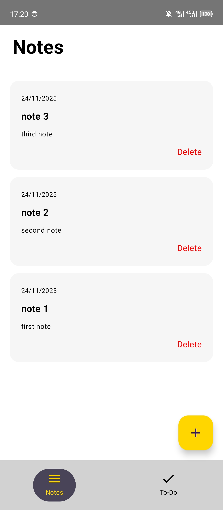
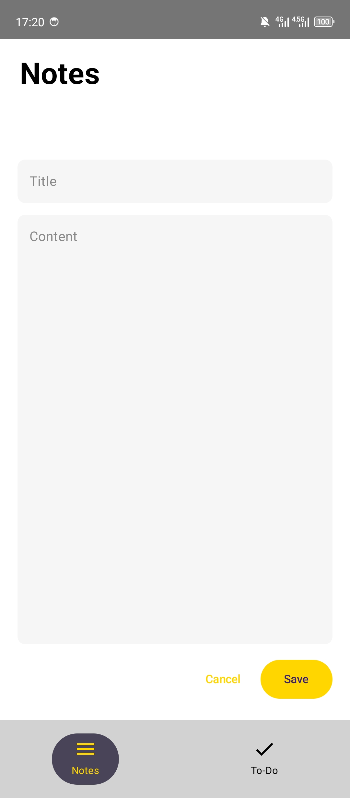

# 📒 MakeNotes – Simple & Fast Notes App

MakeNotes is a clean, modern Android notes application built using **Kotlin**, **Jetpack Compose**, and **Room Database**.  
It focuses on **simplicity**, **speed**.

---

## ✨ Features

### 📝 Notes
- Create notes (title + content)  
- Edit existing notes  
- Delete notes  
- Beautiful rounded card design  
- Automatic date display

### ✔️ Todo System
- Mark tasks as completed  
- Completed tasks move to a “Completed” section automatically  
- Clean separation between active todos and completed todos

### 🎨 Modern UI
- Jetpack Compose UI  
- Smooth animations  
- Rounded material cards  
- Clean typography

---

## 📸 Screenshots

> Screenshot (uploaded):

> 

---

## 🛠 Tech Stack

- **Kotlin**  
- **Jetpack Compose**  
- **Room Database**  
- **MVVM Architecture (optional)**  
- **Material3 Components**

---

